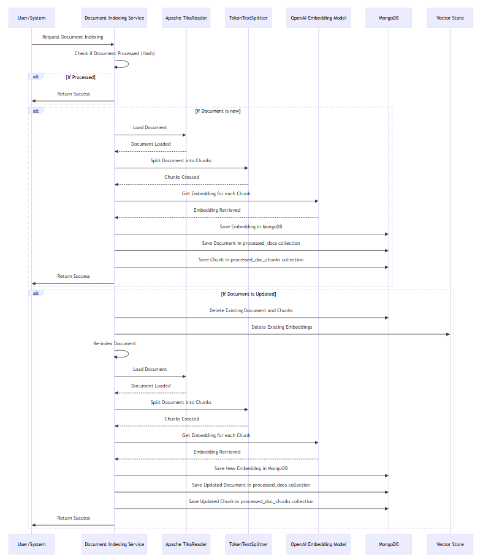
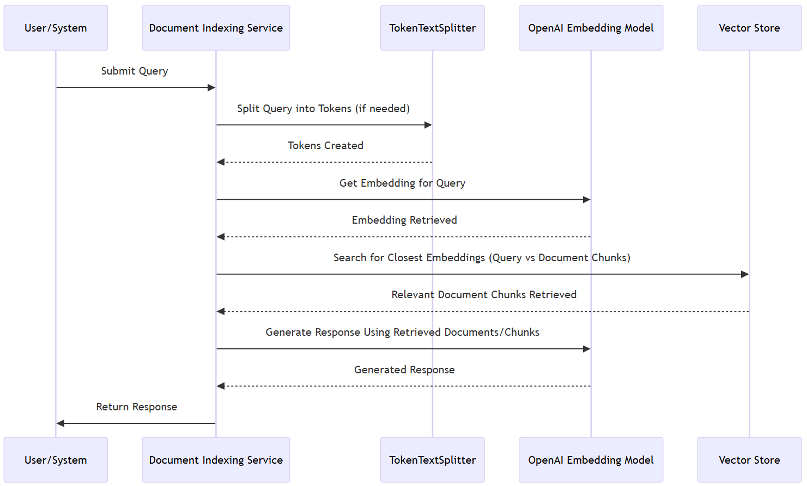

# RAG Application with Spring AI, OpenAI, and MongoDB Atlas

A Retrieval-Augmented Generation (RAG) application that indexes documents from filesystems/URLs and provides AI-powered querying capabilities.

## Features
- **Document Indexing**:
    - From local filesystem or URL
    - Automatic deduplication using document hashes
    - Chunking with Spring AI's `TokenTextSplitter`
- **AI Integration**:
    - OpenAI embeddings generation
    - LLM response generation
- **Vector Storage**:
    - MongoDB Atlas Vector Search
    - Efficient document/chunk management
- **Query Interface**:
    - Standard and streaming response endpoints

## Prerequisites
- Java 17+
- Apache Maven 3.8+
- MongoDB Atlas cluster (with vector search configured) or have docker installed to run mongo DB locally
- OpenAI API key

## Indexing Flow



## Retrieval Flow:



## Steps to run
1. Clone repository:
   ```bash
   git clone https://github.com/ashishkumar-07/spring-ai-rag-demo.git
2. Run the mongo DB docker container from inside the directory
   ```bash
   docker compose up -d 
   OR
   podman compose up -d 
3. Run the application from inside the directory
   ```bash
   .\mvnw spring-boot:run
   
